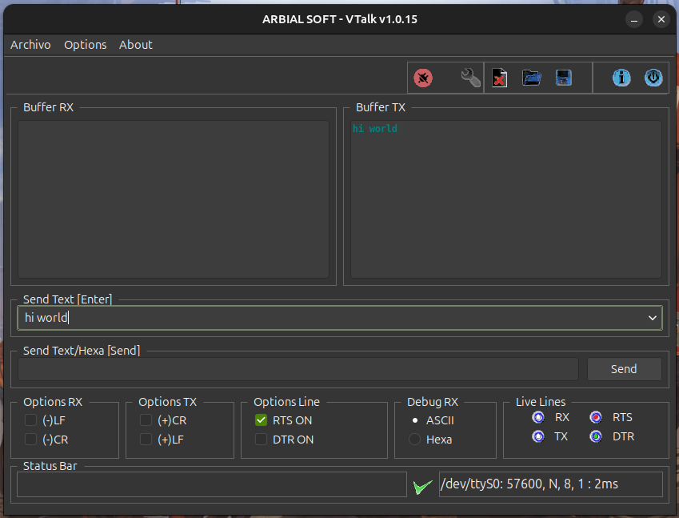

# VTALK

A simple and lightweight **Serial (RS232) Port Terminal** written in **Gambas 3**.

Send and receive data through serial ports easily.

The name is a tribute to a friend who made one in C for DOS that I used for a long time.

---

## Features

- Open and communicate with serial ports
- Send and receive data
- Clean and simple interface
- Built with Gambas 3.22

---

## Screenshots



---

## Download

You can download the latest release here:

**[Latest Release](https://github.com/MonsterMaze/Serial-Port-Monitor/releases/tag/serial-terminal)**

Available formats:

- **AppImage** (recommended – runs on most Linux distributions)
- **.deb** package (for Debian / Ubuntu / Linux Mint)
- **.gambas** executable

---

## Requirements

- Linux
- Gambas 3.22 or higher (only needed if running the `.gambas` file)
- Serial port access permissions

---

## How to run

### AppImage
```bash
chmod +x VTalk-*.AppImage
./VTalk-*.AppImage
